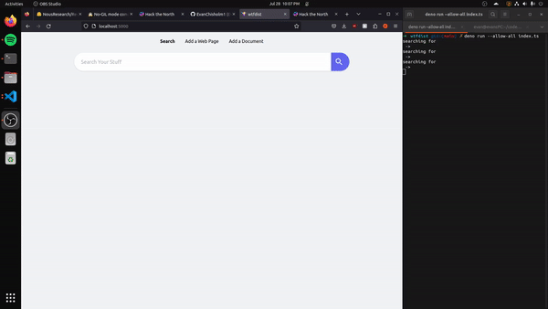
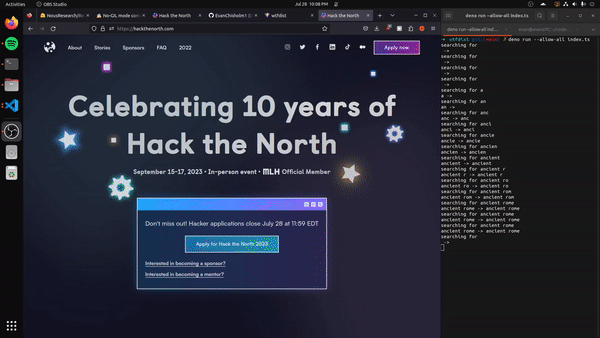

# Where the F\*ck did I see that?

Where the f\*ck did I see that (wtfdist) is a project for helping you find things that you have recently seen on the internet but can't remember where. Think of it like your web bookmarks but on steroids.

[web client repo](https://github.com/EvanChisholm1/wtfdist-client)

## demos:

Search:

Adding Document:

